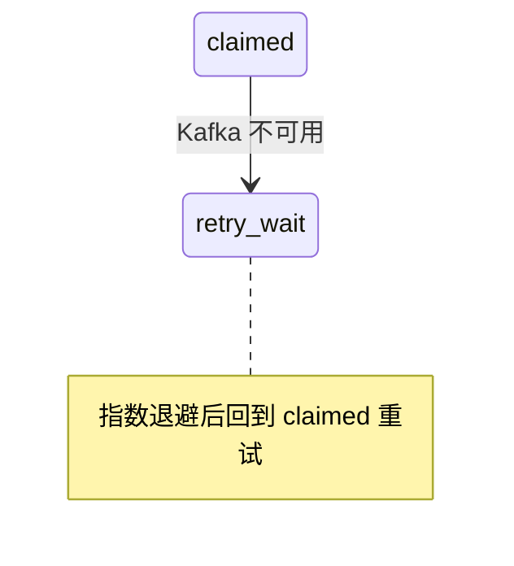

# 画图范式（内联 SVG：架构图 · 时序图 · 状态机）

设计稿内**所有**图一律按本范式画——现画的、从产物转译的都适用，不是可选项。三类图：架构图（§一–§五）、泳道时序图（§六）、状态机（§七）。风格稳定靠三条：结构件套齐全、配色引模板变量、交互按规模自适应（规则判定，不靠用户记）。

## 零、下笔前先定「这张图讲哪一件事」

借 `eli5` 插件（`eli5@claude-community`）的取向：**大图、少字、只讲一件事**。它本身是一段提示词而不是渲染器，产出是整页 HTML explainer，格式与本模板不兼容——**不要直接调用它生成图**，借的是它的判断标准：

- **一张图只回答一个问题。** 下笔前先用一句话写出「这张图要让读者看懂什么」。**写不出来就不画**——把缺图记进缺口栏，不许硬凑。一张图同时讲结构、讲流程、讲失败路径，必然乱。这条压过「尽量画图」：讲不清的图比没有图更糟。
- **字要少。** 标签牌超过 8 个字就说明这条线承担了太多；把解释挪到图下的 `cap` 行或正文。节点副标题一行封顶。
- **画不下就拆。** 节点超过十来个、连线超过 12 条，拆成两张图，不要挤。

自检一句话：把图给一个没读过正文的人看，他能不能说出「这张图在讲什么」。说不出就是没画对。

## 零点二、先选画法：HTML/CSS 盒子还是内联 SVG

**默认用 HTML/CSS 盒子，只有泳道时序图用 SVG。**

理由是实测出来的：SVG 里每个元素的位置是人填的数字，填错了没有任何东西会拦住你——标签压住节点、连线穿过框、斜线交叉成网，都是这么来的。HTML/CSS 里位置是浏览器算的，盒子天生不会重叠。

| 图的类型 | 用什么 | 为什么 |
|---|---|---|
| 分层架构图、模块关系图 | **HTML/CSS 盒子** | 分层 = 容器，节点 = 弹性盒；浏览器负责排版，零重叠 |
| 流程步骤（几步走完一件事） | **HTML/CSS 胶囊 + 箭头** | 一行胶囊按顺序排，箭头是胶囊之间的字符，不需要算坐标 |
| 泳道时序图 | **内联 SVG**（§六） | 生命线、跨泳道箭头、时间顺序，用盒子表达不了 |
| 状态机 | 二选一（§七） | 状态少、迁移是链式的用盒子；有回环、有分支的用 SVG |

### HTML/CSS 画法骨架

样式写在图专属 `<style>` 里，选择器一律以 `.dgm` 开头限定作用域；配色只引模板 CSS 变量，不自造颜色。

```html
<div class="dgm">
  <div class="lane"><h4>层名（如「领域 · 发布事务」）</h4>
    <!-- chain = 有先后顺序；连接符是真元素，盒子之间各插一个 -->
    <div class="chain">
      <div class="bx"><b>上游组件</b><span>一行职责</span></div>
      <svg class="conn" viewBox="0 0 30 18"><path class="l" d="M0 9 H22"/><path d="M17 5 L24 9 L17 13"/></svg>
      <div class="bx new"><b>本期新建</b><span>一行职责</span></div>
      <svg class="conn async" viewBox="0 0 30 18"><path class="l" d="M0 9 H22"/><path d="M17 5 L24 9 L17 13"/></svg>
      <div class="bx ext"><b>外部依赖</b><span>一行职责</span></div>
    </div>
    <!-- row = 并列，无先后，不插连接符 -->
    <div class="row">
      <div class="bx"><b>同级组件甲</b><span>一行职责</span></div>
      <div class="bx"><b>同级组件乙</b><span>一行职责</span></div>
    </div>
  </div>
  <!-- 层与层之间的竖箭头 -->
  <div class="down">
    <svg viewBox="0 0 24 30"><path class="l" d="M12 0 V22"/><path d="M8 17 L12 24 L16 17"/></svg>
    <span>②③ 这一步干什么</span>
  </div>
  <div class="lane"><h4>下一层</h4>
    <div class="chain">…</div>
    <div class="down async">
      <svg viewBox="0 0 24 30"><path class="l" d="M12 0 V22"/><path d="M8 17 L12 24 L16 17"/></svg>
      <span>⑫ 异步回程，虚线</span>
    </div>
  </div>
  <p class="note">图例：绿框 = 本期新建；白框 = 已有；蓝框 = 外部依赖。实线 = 正常路径，虚线 = 异步回程。</p>
</div>
```

**连接符必须是真元素，不要用 CSS 伪元素画三角形。** 伪元素三角有两个坑，都是实测踩出来的：

1. **换行时留下半截箭头**——盒子折到下一行，横箭头还留在原位指向空处，看起来就是「箭头只显示一半」。
2. **线和箭头是两个东西**，接缝处对不齐；用一个 `<svg>` 里的两条 path，线与箭头一笔画成，永远不会错位。

**链不换行**（`flex-wrap:nowrap` + `overflow-x:auto`）：链表示「有先后顺序」，序列不该被折断。窄屏放不下就横向滚动，箭头永远指着对的方向。并列的 `.row` 照常换行。

**`.chain` 和 `.row` 的区别是这套画法的关键**：`.chain` 表示「有先后顺序」，浏览器自动在盒子之间画横箭头；`.row` 表示「并列存在，没有先后」，不画箭头。**别全用 `.row`——那样图上只有框没有线，读者看不出谁连谁。**

层与层之间用 `.down`（带竖箭头和说明胶囊），异步回程加 `.async` 转虚线。箭头全部由 CSS 画，不需要算任何坐标。

六条约束：

- **有先后用 `.chain`，并列用 `.row`**——只有 `.chain` 会自动出箭头。图上只有框没有线，多半是全写成 `.row` 了。
- **层用 `.lane`，节点用 `.bx`**——`.bx.new` 本期新建（松绿）、`.bx.ext` 外部依赖（青蓝）、无修饰 = 已有。语义靠这三档，不另造颜色。
- **节点副标题一行封顶**，写不下说明职责没想清楚。
- **步骤流用 `.flow` + `.step`**，编号放 `<i>`，箭头用 `→` 字符——不画线就不会有线穿框的问题。
- **图例写进 `.note`**，不要指望读者猜颜色含义。
- **`.row` 用 `flex-wrap`**，窄屏自动折行；不要给盒子写死宽度。

**配套 CSS 已内置在 `template.html`**（`.dgm` 及其子类），图内直接用类名即可，不要重写一份——重写就会各文档风格漂移。需要新增语义档位时改的是 `template.html`（母本升级，在 projkit 里改，随刷新分发）。

## 零点三、Markdown 里的 mermaid：绕开自动布局的三个坑

SPEC 是 Markdown，图只能用 mermaid（进 git、可 diff、GitHub 与 IDE 直接渲染）。mermaid 的布局是自动的，**你无法指定坐标，只能通过改图的结构去影响它**。三个坑都是实测踩出来的：

| 坑 | 后果 | 绕法 |
|---|---|---|
| **自环**（节点指向自己） | 标签压在节点上，盖住节点名 | 拆节点：把一个组件按角色拆成两三个节点，环就消失了 |
| **双向边**（A→B 且 B→A） | 两条边的标签**可能**叠成糊字 | 先渲染看：标签并排排开就留着（来回两个转换本来就该画出来），糊在一起才把反向那条改成 `note` |
| **LR 方向 + 节点多** | 图横向拉得极宽，超出页面被截断 | 换 `TB`（自上而下）；或减少节点 |

**自环和 LR 过宽是硬规则，双向边是风险信号。** 双向边糊不糊取决于两个标签的长度和节点间距，只能渲染出来才知道——短标签往往并排排得开，长标签就会叠。糊了的话改成这样：



**渲染检查**：本机若有 npx 缓存过的 mermaid（`~/.npm/_npx/*/node_modules/mermaid/dist/mermaid.min.js`），拷一份到临时目录，用无头浏览器离线渲染逐张截图看；没有就在 IDE 或 GitHub 预览里逐张过目。**光看 mermaid 源码判断不了图乱不乱**——源码规整的图渲染出来照样可能糊成一团。

## 零点五、布线铁律（SVG 图专用，最容易翻车的一条）

**本节只管 SVG 图**（时序图、状态机）。架构图与流程图改用 HTML/CSS 盒子后不涉及布线，见 §零点二。

**连线一律横平竖直的正交折线，禁止斜线。** 斜线一多图就成一团——这是实测翻车最多的一条，比坐标算错更致命。

- 同层相邻：横线直连。
- 跨层：竖线，或 `⌐` 形折线绕开节点，拐角一律直角。
- 折线要绕开中间的节点框，不许从框上穿过去。
- **标签牌放在线段的直线段中点**，且不得与任何节点框相交——压住节点标题是硬伤。

排完必须做几何自检（见 §八），不能靠眼估。

## 一、结构五件套

1. **分层色带**：横向 rect 色带分 3~5 层，每层左上角一枚层标（如「数据面 · 同步路径」「控制面」「执行层」「事件总线」）；层高 100~120px。层从上到下按「请求进入 → 控制 → 执行 → 沉淀」的叙事排。
2. **节点组**：`<g class="node" data-node="唯一id">` = 圆角 rect + 主标题（组件名）+ 副标题（一行职责）。
3. **连线**：横平竖直的正交折线（line / path 拐直角），统一箭头 marker；按通道类型分色分线型——实线 = 同步/热路径，虚线 = 异步/供给/带外。
4. **标签牌**：每条线中点压一块白底小 rect + 一行字（接口编号 + 一句话）——这是零上下文读者能读懂图的关键，无标签的线不许出现。
5. **图例 + 读法导语**：图下 `fig-legend` 列线型含义；图上方 lede 里给一句「图的读法」（先看哪层、主线怎么走）。

## 二、排版算法

- 先分层再排节点：层内等距横排，节点宽随文字（≈ 字数 × 13px + 40）；viewBox 宽 800~960，高 = 层数 × 层高 + 上下边距。
- 连线只走横竖：同层相邻横线直连，跨层竖线或 ⌐ 形折线绕开节点；标签牌放线段中点、避让节点框。
- **节点十来个上限照旧**（spec-design 硬要求同款）——超了说明该拆成两张图。
- 同页多图时，`<defs>` 里的 marker id 用 `<图id>-` 前缀防撞。

## 三、配色与字体（风格一致的机制）

- 基础色一律引用模板 CSS 变量：节点框 `var(--card)` + 描边 `var(--ink)`、文字 `var(--ink)`/`var(--ink2)`、层带 `var(--pine-faint)`、标签牌描边 `var(--line)`。
- 通道语义色允许少量自定（如琥珀 = 管理面、青 = 事件流），写在图专属 style 里并进图例。
- 字体不自设，模板已让 `.flowviz svg text` 继承正文字体。

## 四、交互（按需，两档）

- **静态档**：连线 ≤8 条或流向单一 → 全览静态图，不加任何 JS。
- **交互档**：流向 ≥3 类且连线 >8 条 → 加两样（实现照 §五 模板）：
  - 筛选 chips：图上方按钮组，点击给 figure 设 `data-filter`，CSS 按 `data-flow` 词组匹配淡出无关元素；
  - 悬停高亮：节点 `mouseenter` 时给 `data-nodes` 不含它的元素加 `.hover-dim`。
- 静态档也照常标注 `data-flow`/`data-nodes` 属性（成本为零，后续升交互档不用重排）。
- 交互只做减法：无 JS 环境（打印、邮件预览）自动呈现全览静态图。
- **作用域红线**：图专属 style/script 的选择器与逻辑一律以本图 id 开头。

## 五、骨架样例

静态档最小骨架（两层三节点；真实图按此结构扩展）：

```html
<figure class="flowviz" id="fig-topo">
  <svg viewBox="0 0 800 268" role="img" aria-label="示例拓扑">
    <title>示例拓扑</title>
    <desc>一句话描述图的分层与主线，供读屏与检索。</desc>
    <defs><marker id="fig-topo-ah" viewBox="0 0 10 10" refX="8" refY="5" markerWidth="6.5"
      markerHeight="6.5" orient="auto-start-reverse"><path d="M2 1L8 5L2 9" fill="none"
      stroke="context-stroke" stroke-width="1.5" stroke-linecap="round" stroke-linejoin="round"/></marker></defs>

    <rect class="band" x="0" y="16" width="800" height="104"/>
    <text class="band-label" x="10" y="32">服务层</text>
    <rect class="band" x="0" y="152" width="800" height="96"/>
    <text class="band-label" x="10" y="168">数据层</text>

    <g class="node" data-node="cli" data-flow="req">
      <rect x="40" y="44" width="170" height="52" rx="4"/>
      <text class="bt" x="125" y="65">调用方</text>
      <text class="bs" x="125" y="84">SDK / 前端</text>
    </g>
    <line class="e-req" data-flow="req" data-nodes="cli svc" x1="210" y1="70" x2="296" y2="70"
      marker-end="url(#fig-topo-ah)"/>
    <g class="plate" data-flow="req" data-nodes="cli svc">
      <rect x="218" y="56" width="70" height="14"/>
      <text x="253" y="66.5">IF-1 REST</text>
    </g>
    <g class="node" data-node="svc" data-flow="req evt">
      <rect x="300" y="44" width="200" height="52" rx="4"/>
      <text class="bt" x="400" y="65">订单服务</text>
      <text class="bs" x="400" y="84">校验 · 编排</text>
    </g>
    <line class="e-async" data-flow="evt" data-nodes="svc db" x1="400" y1="96" x2="400" y2="180"
      marker-end="url(#fig-topo-ah)"/>
    <g class="node" data-node="db" data-flow="evt">
      <rect x="310" y="184" width="180" height="48" rx="4"/>
      <text class="bt" x="400" y="204">PostgreSQL</text>
      <text class="bs" x="400" y="222">订单主数据</text>
    </g>
  </svg>
  <figcaption>图题一句话。</figcaption>
</figure>
<style>
/* 作用域红线：全部选择器以 #fig-topo 开头 */
#fig-topo .band{fill:var(--pine-faint);opacity:.55}
#fig-topo .band-label{font-size:11px;fill:var(--ink2);letter-spacing:.08em}
#fig-topo .node rect{fill:var(--card);stroke:var(--ink);stroke-width:1.1}
#fig-topo .node .bt{font-size:13px;font-weight:600;fill:var(--ink);text-anchor:middle}
#fig-topo .node .bs{font-size:11px;fill:var(--ink2);text-anchor:middle}
#fig-topo line{stroke-width:1.4;fill:none}
#fig-topo .e-req{stroke:var(--ink)}
#fig-topo .e-async{stroke:#8a6d1f;stroke-dasharray:4 3}
#fig-topo .plate rect{fill:var(--card);stroke:var(--line)}
#fig-topo .plate text{font-size:10px;fill:var(--ink2);text-anchor:middle}
</style>
```

交互档在此之上追加（chips + 筛选 CSS + 悬停脚本；`req`/`evt` 换成实际流向名，每个流向一条 CSS）：

```html
<div class="fig-chips" id="fig-topo-chips" aria-label="流向筛选">
  <button data-f="" class="on">全览</button>
  <button data-f="req">请求路径</button>
  <button data-f="evt">事件流</button>
</div>
<style>
#fig-topo-chips{display:flex;gap:8px;margin:12px 0 4px}
#fig-topo-chips button{font-size:12px;padding:3px 10px;border:1px solid var(--line);
  border-radius:999px;background:var(--card);color:var(--ink2);cursor:pointer}
#fig-topo-chips button.on{color:var(--ink);border-color:var(--ink)}
#fig-topo[data-filter="req"] [data-flow]:not([data-flow~="req"]){opacity:.13}
#fig-topo[data-filter="evt"] [data-flow]:not([data-flow~="evt"]){opacity:.13}
#fig-topo .hover-dim{opacity:.15}
</style>
<script>
(function(){
  var fig=document.getElementById('fig-topo');if(!fig)return;
  var chips=document.querySelectorAll('#fig-topo-chips button');
  chips.forEach(function(b){b.addEventListener('click',function(){
    chips.forEach(function(x){x.classList.remove('on')});b.classList.add('on');
    b.dataset.f?fig.setAttribute('data-filter',b.dataset.f):fig.removeAttribute('data-filter');
  });});
  fig.querySelectorAll('.node[data-node]').forEach(function(n){
    var id=n.getAttribute('data-node');
    n.addEventListener('mouseenter',function(){
      if(fig.hasAttribute('data-filter'))return;
      fig.querySelectorAll('[data-nodes],[data-node]').forEach(function(el){
        var ns=(el.getAttribute('data-nodes')||el.getAttribute('data-node')||'').split(' ');
        if(ns.indexOf(id)===-1)el.classList.add('hover-dim');
      });
    });
    n.addEventListener('mouseleave',function(){
      fig.querySelectorAll('.hover-dim').forEach(function(el){el.classList.remove('hover-dim')});
    });
  });
})();
</script>
```

## 六、泳道时序图范式（核心流程章专用）

svg 挂 `class="seqv"`——共享样式模板已内置（生命线、参与者、箭头、标签、注解、循环框全套类名），图内**只需要自己的 marker defs**，不写 style 块（新增流向色才写，作用域照红线）。

结构件套：

1. **参与者头排**：顶部一排圆角 rect + 名字——本模块组件用 `.actor`（松绿），外部件用 `.actor.ext`（青蓝）；4~6 个为宜，超了说明流程该拆。
2. **生命线**：每个参与者一条竖虚线 `.ll`，从头排底部到 cap 区上方。
3. **消息箭头**：自上而下按时间序，y 间距 24~28px；普通消息 `.ar`（灰）、主线/关键写入 `.arg`（松绿加粗）、返回/回执加 `.ard`（虚线）。箭头 marker 三条硬规矩，都是实测踩出来的：

   - **`markerUnits="userSpaceOnUse"` 必须写**。默认值是 `strokeWidth`，箭头尺寸会乘以线宽——`.ar`（1.3）和 `.arg`（1.6）的箭头因此一大一小，同一张图里两种箭头，粗的那个还会越过生命线。
   - **`refX` 取 viewBox 右端**（`viewBox="0 0 10 10"` 就写 `refX="10"`），锚点落在箭尖上，箭尖正好停在路径终点。refX 取 9 会让箭尖多探出一截，压在目标生命线上。
   - **marker 用固定色**（`fill="#54645d"` / `fill="#1e5c4f"`），**不要用 context-fill**：共享样式给消息线设了 `fill:none`，context-fill 会跟着变「无」，箭头直接隐形。

   配好这三条之后，消息线终点直接写目标生命线的 x，不需要再手动留偏移量。

   ```html
   <marker id="图id-a" viewBox="0 0 10 10" refX="10" refY="5"
           markerWidth="9" markerHeight="9" markerUnits="userSpaceOnUse"
           orient="auto-start-reverse"><path d="M0 0L10 5L0 10z" fill="#54645d"/></marker>
   ```
4. **自环消息**（自己调自己）：画成向右伸出的小方钩再折回同一条生命线，终点写生命线的 x。**不画钩就只剩一行标签**，读者看不出那是一条消息。方钩占两行高度，排版时要把这一行的高度算进去。
5. **消息标签**：每条箭头上方压白底小 rect `.bg` + 一行字 `.mt`——无标签的消息不许出现。两条硬规矩：

   - **衬块和文字必须画在消息线之前**。SVG 是后画的盖先画的：衬块画在后面，它的白底会把箭头上半截涂掉，看起来就像箭头「只显示一半」。顺序是「衬块 → 文字 → 线与箭头」。
   - **衬块宽度按中英文分别估**：中日韩字符约 1.0em、其余约 0.55em。用 `len()` 统一乘一个系数，中英混排的标签会宽出一大截，横跨到箭头位置。

   排完做一次机器自检：每条消息线终点的箭头区域（终点 ±9 × ±5）不许落进任何衬块矩形里。
6. **注解块**：`.nb` 琥珀底 rect + `.nt` 文字——多步骤合并（如「验收五步：…」）或规则说明放这里，别拆成八条箭头。
7. **循环框**：流式/重复段用 `.loopbox` 虚线框圈起 + 左上角 `.loopl` 标「循环 · 什么范围」。
8. **图下 cap 行**（本范式的灵魂，固定两行起）：`.cap` 文字——「时限：…」「失败时：…」；有第三行写补充语义。时限与失败语义不进图就等于没设计。

排版：viewBox 宽 960；生命线等距；标签避让生命线；marker id 用 `<图id>-` 前缀防撞。

最小骨架（两参与者一来一回；真实图按此扩展）：

```html
<figure class="flowviz">
  <svg class="seqv" viewBox="0 0 960 220" role="img" aria-label="示例时序">
    <title>示例时序</title>
    <desc>一句话：谁发起、走到谁、什么结果。</desc>
    <defs><marker id="sq-a" viewBox="0 0 10 10" refX="9" refY="5" markerWidth="7" markerHeight="7"
      orient="auto-start-reverse"><path d="M0 0L10 5L0 10z" fill="#54645d"/></marker>
    <marker id="sq-g" viewBox="0 0 10 10" refX="9" refY="5" markerWidth="7" markerHeight="7"
      orient="auto-start-reverse"><path d="M0 0L10 5L0 10z" fill="#1e5c4f"/></marker></defs>
    <line class="ll" x1="120" y1="52" x2="120" y2="150"/>
    <line class="ll" x1="480" y1="52" x2="480" y2="150"/>
    <g class="actor ext"><rect x="72" y="18" width="96" height="28" rx="3"/><text x="120" y="37">调用方</text></g>
    <g class="actor"><rect x="430" y="18" width="100" height="28" rx="3"/><text x="480" y="37">本模块</text></g>
    <path class="arg" d="M120 84 L476 84" marker-end="url(#sq-g)"/>
    <rect class="bg" x="240" y="66" width="120" height="14"/><text class="mt" x="300" y="77">IF-1 提交请求</text>
    <path class="ar ard" d="M480 120 L124 120" marker-end="url(#sq-a)"/>
    <rect class="bg" x="250" y="102" width="100" height="14"/><text class="mt" x="300" y="113">结果 / 回执</text>
    <text class="cap" x="26" y="182">时限：X ms / 秒（P99 口径写明含什么不含什么）。</text>
    <text class="cap" x="26" y="202">失败时：判断不了就拒（fail-closed）；谁兜底、什么绝不许发生。</text>
  </svg>
  <figcaption>图题一句话。</figcaption>
</figure>
```

## 七、状态机范式（领域对象与实例生命周期专用）

svg 挂 `class="stm"`——共享样式模板已内置，图内只需要自己的 marker defs（普通转移一个灰 marker，危险转移一个赤 marker）。

结构件套：

1. **起点**：实心圆 `.dot` + 灰箭头指向初始状态。
2. **状态框**：圆角 rect + 状态名 `.nt` + 一行说明 `.ns`；语义分色——中性 `.st`、健康 `.st.ok`（松绿）、降级/暂存 `.st.warn`（琥珀）、终态/摘除/拒收 `.st.bad`（赤）。
3. **转移**：普通 `.e`（灰）、危险/不可逆 `.er`（赤）；每条转移旁放触发条件标签 `.lb`（危险的用 `.lbr`），标签不压框。
4. **图下 cap 行**：`.cap` 写全局规则（如「已进坏副本的请求仍拒绝」「重启回到起点从零重拉」）。

排版：健康主线横排在上层，异常/终态放下层；状态 5~7 个为宜，超了拆图；回环转移用弧线（`<path d="M… Q…">`）绕开框。

最小骨架：

```html
<figure class="flowviz">
  <svg class="stm" viewBox="0 0 800 240" role="img" aria-label="示例状态机">
    <title>示例状态机</title>
    <desc>一句话：几个状态、主线怎么走、什么情况进坏态。</desc>
    <defs><marker id="sm-x" viewBox="0 0 10 10" refX="9" refY="5" markerWidth="7" markerHeight="7"
      orient="auto-start-reverse"><path d="M0 0L10 5L0 10z" fill="#54645d"/></marker>
    <marker id="sm-xr" viewBox="0 0 10 10" refX="9" refY="5" markerWidth="7" markerHeight="7"
      orient="auto-start-reverse"><path d="M0 0L10 5L0 10z" fill="#b3372b"/></marker></defs>
    <circle class="dot" cx="36" cy="72" r="8"/>
    <g class="st"><rect x="76" y="50" width="150" height="44" rx="5"/><text class="nt" x="151" y="72">准备中</text><text class="ns" x="151" y="87">未就绪 · 不服务</text></g>
    <g class="st ok"><rect x="330" y="50" width="140" height="44" rx="5"/><text class="nt" x="400" y="72">就绪</text><text class="ns" x="400" y="87">正常服务</text></g>
    <g class="st bad"><rect x="580" y="50" width="150" height="44" rx="5"/><text class="nt" x="655" y="72">已摘除</text><text class="ns" x="655" y="87">终态 · 等运维</text></g>
    <line class="e" x1="44" y1="72" x2="76" y2="72" marker-end="url(#sm-x)"/>
    <line class="e" x1="226" y1="66" x2="330" y2="66" marker-end="url(#sm-x)"/>
    <text class="lb" x="234" y="58">条件齐备</text>
    <path class="er" d="M470 66 L580 66" marker-end="url(#sm-xr)"/>
    <text class="lbr" x="478" y="58">不可逆故障</text>
    <text class="cap" x="26" y="200">全局规则一句话（如：任何状态下判断不了就拒）。</text>
  </svg>
  <figcaption>图题一句话。</figcaption>
</figure>
```

## 八、落盘后必须截图目检（硬步骤，不是「条件允许」）

图画歪了、标签压住节点、线穿过框——**这些只有渲染出来才看得见**，坐标算得对不代表画得对。落盘后必须实际渲染检查。

### 怎么截

先探测本机有没有 Chromium 内核浏览器，**不要硬编码路径**——本 skill 随样板分发到各种机器，写死 macOS 路径在 Linux / Windows 上必然失败：

```bash
find_browser() {
  for c in "$CHROME_BIN" \
    "/Applications/Google Chrome.app/Contents/MacOS/Google Chrome" \
    "/Applications/Chromium.app/Contents/MacOS/Chromium" \
    "/Applications/Microsoft Edge.app/Contents/MacOS/Microsoft Edge" \
    "$(command -v google-chrome 2>/dev/null)" \
    "$(command -v chromium 2>/dev/null)" \
    "$(command -v chromium-browser 2>/dev/null)" \
    "$(command -v msedge 2>/dev/null)"; do
    [ -n "$c" ] && [ -x "$c" ] && { printf '%s' "$c"; return 0; }
  done
  return 1
}
CH="$(find_browser)" || { echo "未找到 Chromium 内核浏览器"; exit 3; }
"$CH" --headless --disable-gpu --screenshot=out.png \
  --window-size=1400,2400 --hide-scrollbars --virtual-time-budget=3000 \
  "file:///绝对路径/产物.html"
```

**探测不到怎么办**（不阻断流程）：几何自检照做（那是纯计算，任何机器都能跑），然后在交付时明说「本机没有可用浏览器，图未经渲染检查，请自行在浏览器打开确认」。**不许跳过检查还说通过。**

**逐图单独截**比整页截好用：把每个 `<figure class="flowviz">` 连同模板的 `<style>` 拼成一张单图页面再截，图小、看得清。整页截图适合最后看排版。

### 看什么（逐条过，别扫一眼就过）

| 检查项 | 翻车表现 |
|---|---|
| 标签牌是否压住节点 | 节点标题被白底标签盖掉一半 |
| 连线是否穿过节点框 | 线从框中间穿出去，像划了一刀 |
| 是否有斜线 | 一堆对角线交叉成网（§零点五） |
| 文字是否撑破框 | 字溢出圆角矩形边界 |
| 自环消息 | 时序图里「自己调自己」的消息容易只剩标签、没有箭头 |
| 层标是否被节点压住 | 分层色带左上角的层标被第一个节点盖住 |
| `cap` 行位置 | 说明文字跑进图内容区，而不是在图下方 |

### 机器能查的先用机器查

截图前先跑几何自检，能挡掉一批：元素是否越出 viewBox、节点框之间是否重叠（排除分层色带）、文字估宽是否超过框宽（中文按 1.0em、西文按 0.55em 估）、标签牌是否与节点框相交。

**机器查完还得看图**——机器查不出「斜线太多显得乱」这种问题。
